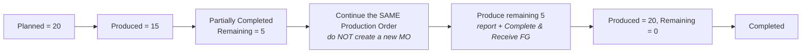
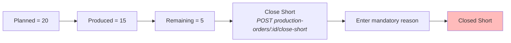
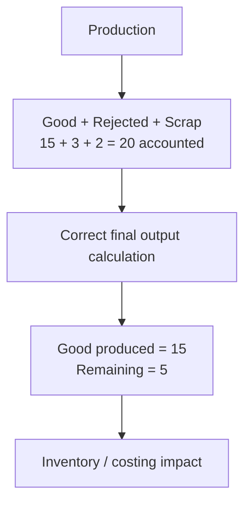
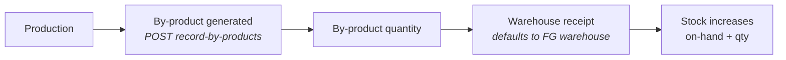
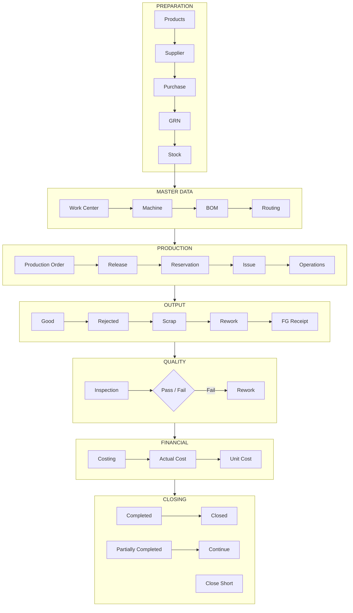
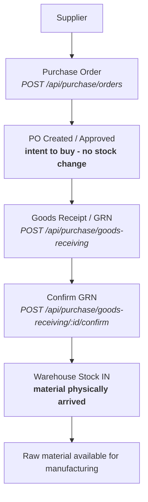
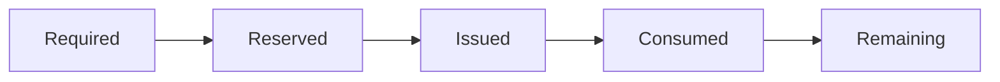
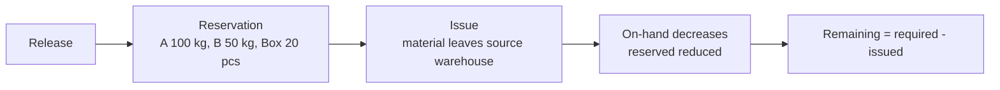
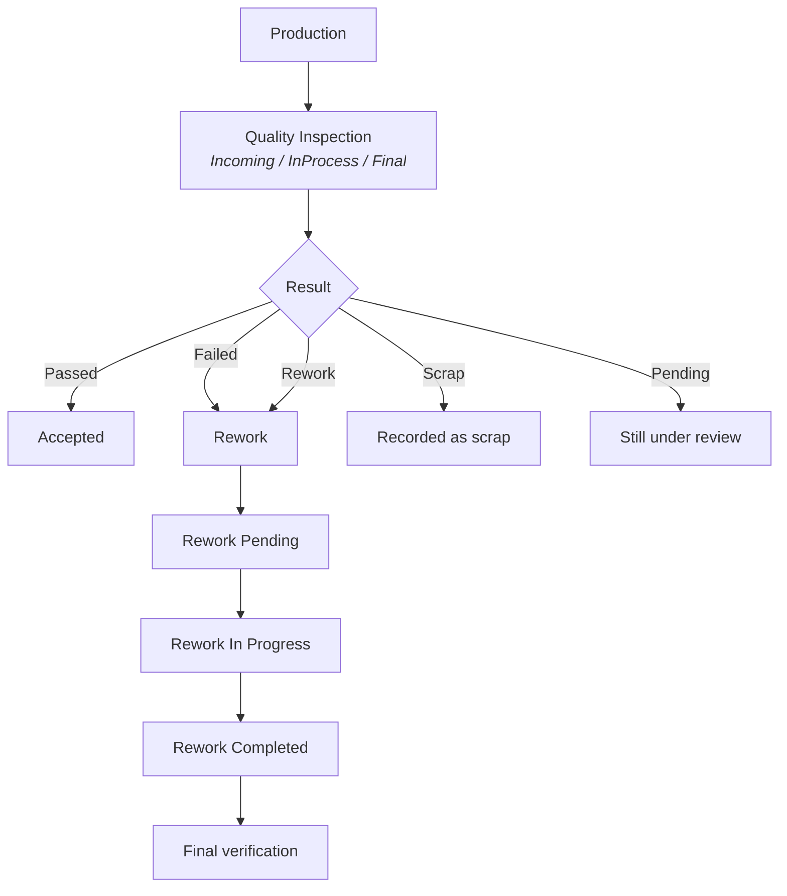
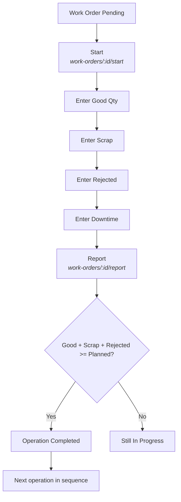

# Bisonstechs ERP — Manufacturing Process Flow (Visual Diagrams)

Visual process maps for the Manufacturing Module. These diagrams match the
actual implemented workflow in this project (verified against
`controllers/manufacturingController.js`, `routes/manufacturingRoutes.js`,
`utils/manufacturingWorkflow.js` and the warehouse purchase/GRN modules).

> **Legend**
> - Rounded box = a **state / step** you act on.
> - Diamond = a **decision**.
> - Solid arrow = the normal path.
> - Dashed arrow = an alternative branch.
> - `(route)` = the API endpoint that performs the step (base `/api/manufacturing`).

---

## 1. The complete manufacturing journey (main flow)

```mermaid
flowchart TD
    A[START] --> B[Create / verify Warehouse<br/><i>(locations)</i>]
    B --> C[Create Raw Material Products<br/><i>(products)</i>]
    C --> D[Create Finished Product<br/><i>(products)</i>]
    D --> E[Create Supplier<br/><i>(warehouse/supplier)</i>]
    E --> F[Purchase Order<br/><i>POST purchase/orders</i>]
    F --> G[Goods Receipt / GRN<br/><i>POST purchase/goods-receiving</i>]
    G --> G1[Confirm GRN]
    G1 --> H[Raw Material Stock Available<br/><i>locations/:id/stock</i>]
    H --> I[Create Work Center<br/><i>POST work-centers</i>]
    I --> J[Create Machine<br/><i>POST machines</i>]
    J --> K[Create BOM<br/><i>POST boms</i>]
    K --> L[Create Routing<br/><i>POST routings</i>]
    L --> M[Create Production Order<br/><i>POST production-orders</i>]
    M --> N[Release Production Order<br/><i>POST production-orders/:id/release</i>]
    N --> O[Material Reservation<br/><i>auto at Release</i>]
    O --> P[Material Issue<br/><i>POST production-orders/:id/issue-materials</i>]
    P --> Q[Start Production<br/><i>POST production-orders/:id/start</i>]
    Q --> R[Operation 1<br/><i>work-orders/:id/start</i>]
    R --> R2[Operation 2]
    R2 --> R3[Operation 3]
    R3 --> S[Report Good / Rejected / Scrap / Downtime<br/><i>work-orders/:id/report</i>]
    S --> T[Production Output]
    T --> U[Finished Goods Receipt<br/><i>POST production-orders/:id/complete</i>]
    U --> V[Quality Inspection<br/><i>POST inspections</i>]
    V --> W{Quality passed?}
    W -- YES --> X[Production Completed]
    X --> Y[Costing<br/><i>GET production-orders/:id/costing</i>]
    Y --> Z[Close<br/><i>POST production-orders/:id/close</i>]
    Z --> END[Order Closed]
    W -- NO --> AA[Rework<br/><i>POST rework</i>]
    AA --> AB[Rework Pending]
    AB --> AC[Rework In Progress]
    AC --> AD[Rework Completed]
    AD --> AE[Final Quality / Production verification]
    AE --> AF[Complete / Close]
    AF --> END

    %% Alternative branches (dashed)
    M -.-> BP[By-product<br/><i>POST production-orders/:id/record-by-products</i>]
    S -.-> SR[Scrap / Rejected<br/><i>record-scrap</i>]
    U -.-> PR[Partial Production<br/>remaining > 0]
    PR -.-> M2[Continue same Production Order]
    M2 -.-> Q
    U -.-> CS[Close Short<br/><i>POST production-orders/:id/close-short</i>]
    CS -.-> CS2[Order Closed Short]
```

---

## 2. Alternative branches

### 2.1 Partial production (Planned 20 → produce 15 → continue → 20)

> Tested in `tests/manufacturing-operation-report.test.js`.



### 2.2 Close short (Planned 20 → 15 → stop remaining 5)



### 2.3 Scrap / Rejected (correct output calculation)



### 2.4 By-product (extra output enters stock)



---

## 3. Production order lifecycle (statuses)

> Matches `ORDER_TRANSITIONS` in `utils/manufacturingWorkflow.js`.

```mermaid
stateDiagram-v2
    [*] --> Draft
    Draft --> Released: Release
    Draft --> Cancelled: Cancel
    Planned --> Released: Release
    Planned --> Cancelled: Cancel
    Released --> "In Progress": Start
    Released --> Paused: Pause/Hold
    Released --> Completed: Complete (remaining = 0)
    Released --> "Partially Completed": Complete (remaining > 0)
    Released --> "Closed Short": Close Short
    Released --> Cancelled: Cancel
    "In Progress" --> Paused: Pause/Hold
    "In Progress" --> Completed: Complete (remaining = 0)
    "In Progress" --> "Partially Completed": Complete (remaining > 0)
    "In Progress" --> "Closed Short": Close Short
    "In Progress" --> Cancelled: Cancel
    Paused --> "In Progress": Resume
    Paused --> Completed: Complete (remaining = 0)
    Paused --> "Partially Completed": Complete (remaining > 0)
    Paused --> "Closed Short": Close Short
    "Partially Completed" --> "Partially Completed": Complete again
    "Partially Completed" --> Completed: remaining = 0
    "Partially Completed" --> "Closed Short": Close Short
    "Partially Completed" --> Cancelled: Cancel
    Completed --> Closed: Close
    Closed --> [*]
    "Closed Short" --> [*]
    Cancelled --> [*]
```

**Key facts the diagram shows:**
- `Draft` and `Planned` can only Release or Cancel.
- `Completed` can only go to `Closed` (unless it still has remaining quantity —
  then Close Short is allowed).
- `Closed`, `Closed Short` and `Cancelled` are terminal.

---

## 4. Master diagram — "Complete journey in 30 seconds"



---

## 5. Purchase → stock flow



**Plain-English meanings:**
- **Purchase Order** = "we intend to buy"
- **GRN / Receipt** = "material physically arrived"
- **Stock** = "material is now available for manufacturing"

---

## 6. Material flow



Example (Finished Product A, BOM: Raw A = 10 kg, Raw B = 5 kg, Box = 2 pcs) for 10 units:



---

## 7. Quality control flow



---

## 8. Shop-floor operation (per operation)



---

## 9. ASCII fallback (no renderer)

```
START
  |
  v
Warehouse --> Raw Material --> Finished Product --> Supplier
  |---> Purchase Order ---> Goods Receipt/GRN (confirm) ---> Raw Stock
  |---> Work Center ---> Machine ---> BOM ---> Routing
  |---> Production Order ---> Release ---> Reservation ---> Issue
  |---> Start Production ---> Op1 ---> Op2 ---> Op3
  |---> Report Good/Rejected/Scrap/Downtime
  |---> Production Output ---> FG Receipt
  |---> Quality Inspection
  |        |-- Passed --> Completed --> Costing --> Close
  |        |-- Failed --> Rework (Pending --> In Progress --> Completed)
  |---> (partial) Partially Completed --> Continue same MO --> Completed
  |---> (stop)   Close Short (reason) --> Closed Short
  |---> (scrap)  Scrap / Rejected recorded
  |---> (extra)  By-product --> warehouse stock IN
```